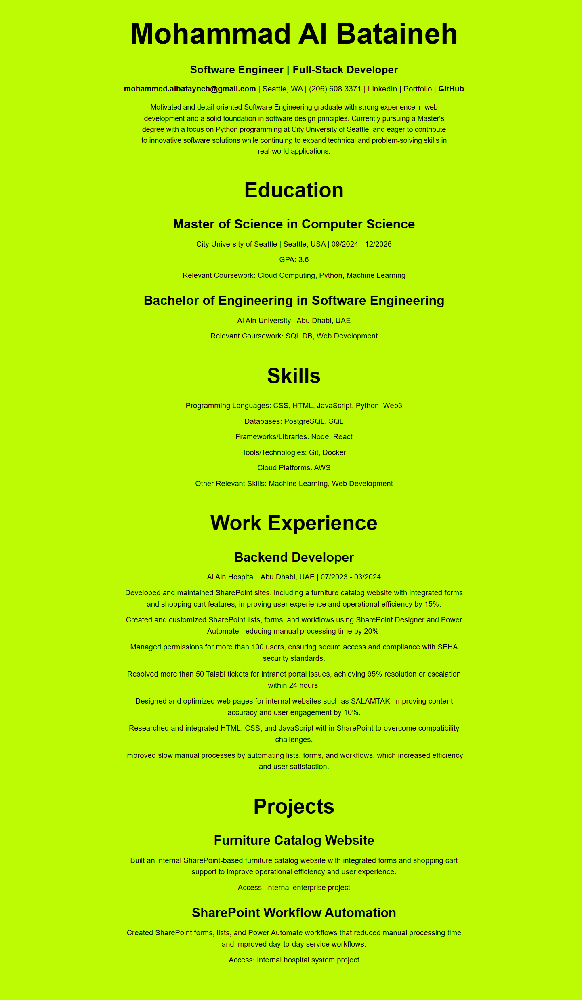

Resume Output Screenshot:

# Input

The input for this program is a structured set of resume details stored directly inside the React `Resume` component. The data includes the student name, headline, contact information, education history, skills, work experience, and projects. Each section is represented as plain JavaScript data such as strings, arrays, and small objects. This approach means the program does not require the user to type anything at runtime. Instead, the resume content is prepared in advance and then rendered by React. The browser also provides a basic input to the system by requesting the application through the development server, loading the JavaScript bundle, and displaying the generated page.

# Process

When the application starts, `App.js` imports and renders `Resume.js`. The `Resume` component reads the resume data object and uses React to map each section into semantic HTML elements such as headings, paragraphs, list items, articles, and links. `Resume.css` controls the visual presentation by applying the required bright green background, black text, centered layout, spacing, and font sizing that match the sample output. The browser then combines the component markup and CSS rules to construct the final page. Because the program uses repeatable data arrays, the sections remain organized, easy to update, and consistent in style.

# Output

The output is a single-page “MyResume” web application that presents a complete resume in a clean, readable format. The page shows the student name and contact information at the top, followed by clearly labeled sections for education, skills, work experience, and projects. Project links remain clickable, the page stays responsive on smaller screens, and the visual style follows the assignment requirements. As a result, the program produces a polished resume page that can be opened in the browser, reviewed by the instructor, and captured in screenshots for submission.